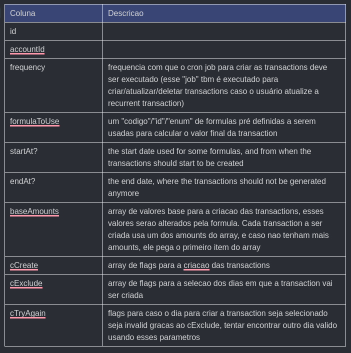

# Recurrent Transaction

## Objetivo

Criar algo que permita o usuário criar transacoes que acontecem de tempos em tempos (recorrente), exemplo:

- Recebimento de salario
- Assinaturas a streamings

## Linha de raciocinio

- Tentamos implementar uma vez, mas ficou muito complexo, imprevisivel e de dificil manutencao, seque o schema usado:

```kotlin
enum CaFormulaEnum {
  EXACT_AMOUNT
  MBWOPM /// MULTIPLY_BY_WEEKS_OF_PREV_MONTH, the amount is multiplied by the amount of weeks of the previous month
  MBDOPM /// MULTIPLY_BY_DAYS_OF_PREV_MONTH, the amount is multiplied by the amount of days of the previous month
  DPFET // DIFFERENT_PERCENTAGES_FOR_EACH_TRANSACTION, the "params" prop is an array of percentages matching each of the transactions that should be created. Using these parameters, the amount of the transaction will be multiplied by the percentage to get the final amount
  CCB // CREDIT_CARD_BILL, sum the value of the transactions to get the amount

  @@map("ca_formula_enum")
}

enum RecurrenceFrequencyEnum {
  DAILY /// Every day
  WEEKLY /// Every week
  MONTHLY /// Once a month
  SEMI_MONTHLY /// One month yes, another month no
  QUARTERLY /// Once every 3 months
  ANNUALLY /// Once a year @map("ANNUALLY")
  SEMI_ANNUALLY /// Once every 6 months

  @@map("recurrence_frequency_enum")
}

enum RecurrenceConditionsEnum {
  IN_WEEKDAY /// Mon-Fri
  IN_WEEKEND /// Sat-Sun
  IS_EVEN_DAY /// Like 2, 4, 6
  IS_ODD_DAY /// Like 1, 3, 5
  NOT_HOLIDAY
  IF_NOT_BEFORE /// If the day doesn't match the conditions, try previuoius days
  IF_NOT_AFTER /// If the day doesn't match the conditions, try following days

  @@map("recurrence_conditions_enum")
}

/// Contains all the user's recurrent transactions.
/// The recurrent transactions are linked to the budget, this way the user can have a better control of which transactions he wants to execute.
model RecurrentTransaction {
  id                String              @id @db.Char(16)
  accountId         String              @map("account_id") @db.Char(16)
  budgetId          String              @map("budget_id") @db.Char(16)
  isSystemManaged   Boolean             @map("is_system_managed") /// Define if the recurrent transaction is automatic controlled by the system, or if it\'s created and controled by the user
  // Data to create the transaction
  type              TransactionTypeEnum
  name              String              @db.VarChar(30)
  description       String              @db.VarChar(300)
  amount            Int /// Can only be POSITIVE, the real amount is determined by the type OUT/CREDIT, then amount * -1
  createdAt         DateTime            @default(now()) @map("created_at")
  isSystemManagedT  Boolean             @map("is_system_managed_t") /// Same as "isSystemManaged". It exists because some RecurrentTransactions may be system managed, but the Trasactions created by this RecurrentTransaction aren't. An example of it it's the salary, we have a specific interface for the user to managed it, and it shouldn't be managed directly by the user like other RecurrentTransactions, but the transactions created by it are normal Transactions, that the user can edit freely.
  // Transaction type=IN,OUT,CREDIT
  categoryId        String?             @map("category_id") @db.Char(16) /// Only type=IN,OUT,CREDIT transactions have this column
  cardId            String?             @map("card_id") @db.Char(16) /// Only type=IN,OUT,CREDIT transactions have this column
  bankAccountId     String?             @map("bank_account_id") @db.Char(16) /// Only type=IN,OUT,CREDIT transactions have this column
  // Transaction type=TRANSFER
  bankAccountFromId String?             @map("bank_account_from_id") @db.Char(16) /// Only type=TRANSFER transactions have this column
  bankAccountToId   String?             @map("bank_account_to_id") @db.Char(16) /// Only type=TRANSFER transactions have this column

  account                   Account                    @relation(fields: [accountId], references: [id], onDelete: Cascade)
  budget                    Budget                     @relation(fields: [budgetId], references: [id], onDelete: Restrict)
  recurrentTransactionRules RecurrentTransactionRule[]
  config                    Config?
  // Transaction type=IN,OUT,CREDIT
  category                  Category?                  @relation(fields: [categoryId], references: [id], onDelete: Restrict)
  card                      Card?                      @relation(fields: [cardId], references: [id], onDelete: Restrict)
  bankAccount               BankAccount?               @relation(name: "RecurrentTransactionBankAccount", fields: [bankAccountId], references: [id], onDelete: Restrict)
  // Transaction type=TRANSFER
  bankAccountFrom           BankAccount?               @relation(name: "RecurrentTransactionBankAccountFrom", fields: [bankAccountFromId], references: [id], onDelete: Restrict)
  bankAccountTo             BankAccount?               @relation(name: "RecurrentTransactionBankAccountTo", fields: [bankAccountToId], references: [id], onDelete: Restrict)

  @@map("recurrent_transactions")
}

/// Contains the recurrent transactions rules to be executed
model RecurrentTransactionRule {
  id                     String @id @db.Char(16)
  recurrentTransactionId String @map("recurrent_transaction_id") @db.Char(16)

  caFormula    CaFormulaEnum              @map("ca_formula")
  caParams     String                     @map("ca_params") @db.VarChar /// JSON stringified prop to pass the params to calculate the amount
  caConditions RecurrenceConditionsEnum[] @map("ca_conditions")

  frequency   RecurrenceFrequencyEnum
  fParams     String                     @map("f_params") @db.VarChar /// JSON stringified prop to pass the params to calculate the frequency
  fConditions RecurrenceConditionsEnum[] @map("f_conditions")

  recurrentTransaction RecurrentTransaction @relation(fields: [recurrentTransactionId], references: [id])

  @@map("recurrent_transaction_rules")
}
```



