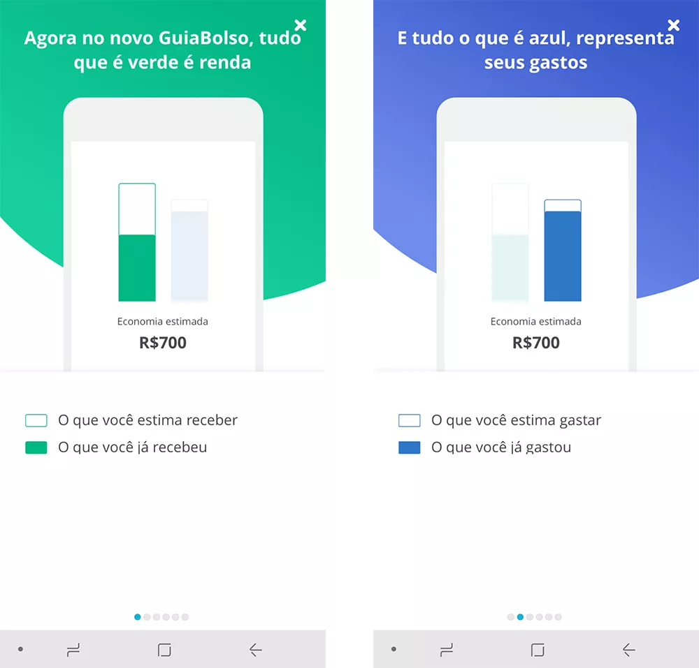
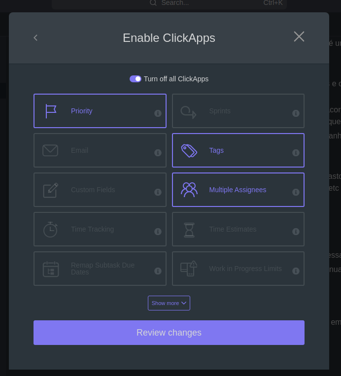
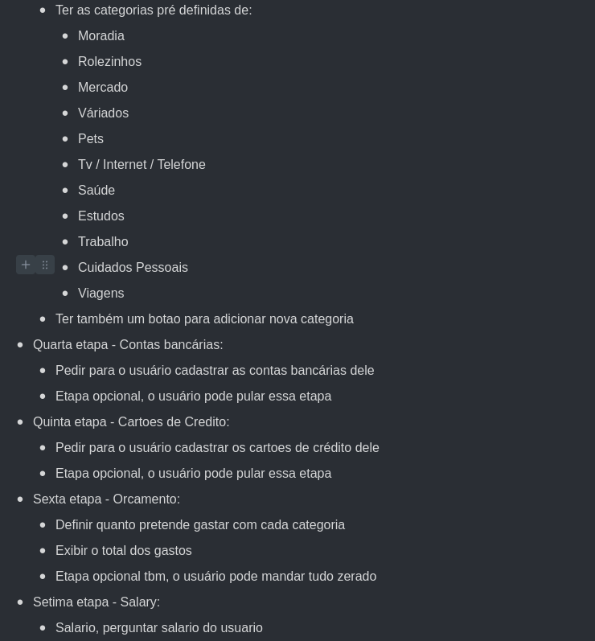

# Onboarding

## Fluxo do onboarding

- Ultima etapa - Parabéns:
  - Parabenizar o usuário por ter concluido isso e depois de uns segundos redireciona-lo para a home (ter algum indicador visual de q ele será redirecionado)
